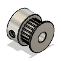
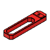
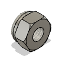
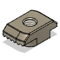
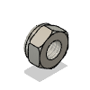

# Hue Master 3000 BOM

|Image|Name|Number|Description|Quantity|
|-|-|-|-|-|
||2020 V-Slot 300mm v2:1|2020 V-Slot 300mm||2|
||2GT 6mm Belt 5mm Shaft v3:1|HW1654WC|Affiliate Link: https://amzn.to/3tqusuo|1|
||Bearing MR85ZZ 5x8x2.5 v4:1|Bearing MR85ZZ 5x8x2.5|Affiliate Link: https://amzn.to/3LHrXdJ|1|
||Bowden Clip v5:1|Bowden Clip|Affiliate Link: https://amzn.to/3LXpI5Z|9|
||Bowden Collet v6:1|Bowden Collet|Affiliate Link: https://amzn.to/3LXpI5Z|9|
||Carrot Feeder Knob v2:1|Carrot Feeder Knob|Printed Part|1|
||Feeder Block v57:1|Feeder Block|Printed Part|1|
||Feeder Stepper Mount v34:1|Feeder Stepper Mount|Printed Part|1|
||Filament Gear Driven Assembly v5:1|Filament Gear Driven Assembly|Affiliate Link: https://amzn.to/3ZD1MdW|9|
||Filament Gear Idler Assembly v2:1|Filament Gear Idler Assembly|Affiliate Link: https://amzn.to/3ZD1MdW|9|
||Flange Coupling 5mm Assembly v4:1|Flange Coupling 5mm Assembly|Affiliate Link: https://amzn.to/46wvvrd|2|
||Foot v8:1|Foot||2|
||GT2 80T Wheel v8:1|GT2 80T Wheel|Printed Part|1|
||GT2 Belt 6x188 mm v2:1|GT2 Belt 6x188 mm|Affiliate Link: https://amzn.to/48znyTP|1|
||Hinged Spine v7:1|Hinged Spine||2|
||M3 Hex Lock Nut v1:1|HW1251NC||2|
||M3 T-Nut 2020 v2:1|HW1665NC|Affiliate Link: https://amzn.to/3RQrWbh|18|
||M3x10 SHCS v4:2|M3x10 SHCS|Affiliate Link: https://amzn.to/45f6QX4|9|
||M3x12 SHCS v3:1|M3x12 SHCS|Affiliate Link: https://amzn.to/3RQOZCR|2|
||M3x20 SHCS v2:1|M3x20 SHCS||1|
||M3x5x4 Threaded Insert v3:7|M3x5x4 Threaded Insert|Affiliate Link: https://amzn.to/48DnORF|10|
||M3x8 SHCS v3:1|M3x8 SHCS|Affiliate Link: https://amzn.to/3thA1vh|26|
||M5 D Shaft 269mm v3:1|M5 D Shaft 269mm||1|
||M5 Hex Lock Nut v2:1|HW1039NC|Affiliate Link: https://amzn.to/3RCXtxg|1|
||M5 Hex Nut v4:1|M5 Hex Nut||2|
||M5 Rod Threaded 205mm v1:1|M5 Rod Threaded 205mm||1|
||M5 Washer v3:2|M5 Washer|Affiliate Link: https://amzn.to/46Cpbyv|3|
||NEMA17 Square Short v5:1|NEMA17 Square Short|Affiliate Link: https://amzn.to/48Glbyz|2|
||Selector Arm v21:1|Selector Arm|Printed Part|9|
||Selector Axle End v12:1|Selector Axle End|Printed Part|1|
||Selector End Stop v15:1|Selector End Stop|Printed Part|1|
||Selector Flange Mount v26:1|Selector Flange Mount|Printed Part|1|
||Shaft Arm v13:1|Shaft Arm|Printed Part|1|
||Spring 20x8 Compressed v2:1|Spring 20x8 Compressed||2|
||Stepper Arm v12:1|Stepper Arm|Printed Part|1|