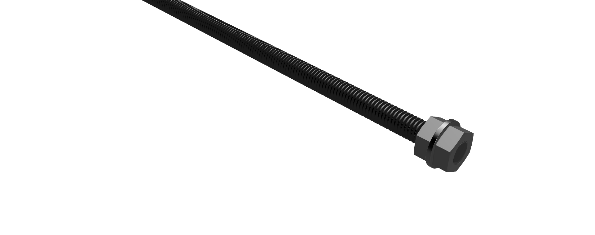

# The Selector
1. Add the idler filament gear (not the one with the set screw), bearings and shaft to the selector arm.
   Repeat for the other eight arms.
    
1. Thread a nut, washer and nut on one end of the threadded rod. Keep the end nut as close to the end of the rod as possible. Crank down on the nuts so they will not slip when running.
    
1. Add four threaded inserts to the flange mount.
    
1. Push the rod through the flange mount. Ensure the end nut is at least flush with the face of the mount.
    
1. Screw the coupling to the mount using four M3x10 screws.
    
